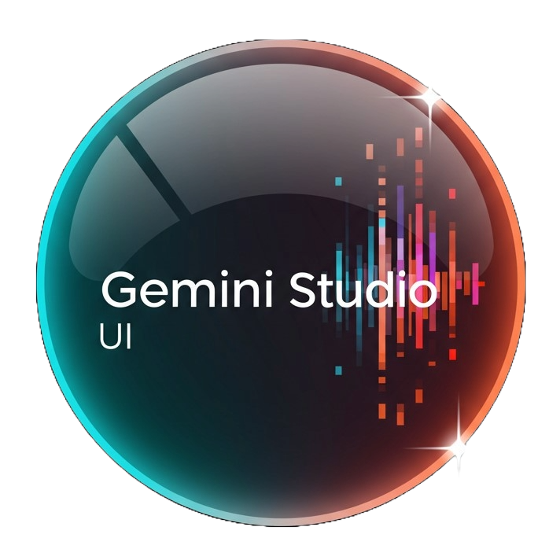

# Gemini Studio UI

<p align="center">
  
</p>

<h3 align="center">An advanced desktop UI for Google Gemini, designed for power users and prompt engineers.</h3>

<p align="center">
  <!-- Optional: Add badges later -->
  <!--  -->
  <!--  -->
</p>

---

## About The Project

Gemini Studio UI is a robust, feature-rich desktop application built with Python and PyQt6. It provides a user-friendly graphical interface for Google's Gemini models, moving beyond simple chat interfaces to offer powerful tools for managing prompts, API keys, and complex generation workflows.

Whether you're testing prompt variations, running parallel generation tasks, or simply need an organized way to interact with the Gemini API, this tool is built to streamline your process.

## Key Features

-   **⚡ Dual Operation Modes:** Switch seamlessly between a simple **Single-Mode** for focused tasks and a powerful **Multi-Mode** for running many parallel generation instances.
-   **🔑 Secure API Key Manager:** Add, rename, and delete multiple Google AI Studio API keys. Keys are encrypted locally on your machine.
-   **📚 Advanced Prompt Manager:** Save, edit, and categorize your favorite prompts. Load them instantly into any instance.
-   **✨ Dynamic Wildcard System:** Automate prompt variations with an easy-to-use wildcard system. Supports random choices (`[option1|option2]`), consistent reuse (`[1:item]`), and repetition (`[item:3]`).
-   **🎨 Customizable Theming:** Ships with Light, Dark, Auto, and a custom "Stellar Teal" theme. Easily add your own `.qss` stylesheets.
-   **🖼️ Metadata Tools:** Automatically embed prompts into generated images and view metadata from existing files to reuse or analyze past prompts.
-   **⚙️ Granular Control:** Fine-tune every API call with controls for temperature, Top-P, max tokens, and content safety settings.

## Screenshots

### Multi-Mode Interface
*The power-user dashboard for running and monitoring multiple instances at once.*


### Single-Mode Interface
*A clean, focused workspace for iterative prompt engineering and single generations.*


## Getting Started

Follow these steps to get a local copy up and running.

### Prerequisites

-   Python 3.9+
-   An API key from [Google AI Studio](https://aistudio.google.com/app/apikey)

### Installation

1.  **Clone the repository:**
    ```bash
    git clone https://github.com/YOUR_USERNAME/Gemini-Studio-UI.git
    ```
2.  **Navigate to the project directory:**
    ```bash
    cd Gemini-Studio-UI
    ```
3.  **Create and activate a virtual environment:**
    ```bash
    # On Windows
    python -m venv venv
    .\venv\Scripts\activate

    # On macOS/Linux
    python3 -m venv venv
    source venv/bin/activate
    ```
4.  **Install the required packages:**
    ```bash
    pip install -r requirements.txt
    ```

## Usage Guide

1.  **Run the application:**
    ```bash
    python main_app.py
    ```
2.  **Add Your API Key:** The first time you run the app, go to **Tools -> API Key Manager** to add at least one Google API key.
3.  **Select a Mode:** Use the **View** menu to switch between Single and Multi modes.
4.  **Configure and Generate:** In your chosen mode, select your API key, model, and write your prompt. Use the wildcards for dynamic content.
5.  **Explore the Tools:** Check out the Prompt Manager, Wildcard Manager, and Settings dialogs to customize your workflow. For detailed syntax help, see the **Help** menu.

## Roadmap

-   [ ] Implement a token counter to estimate costs/usage.
-   [ ] Add support for chat-based models and conversation history.
-   [ ] Enhance the Wildcard Manager with more robust scoring and editing features.
-   [ ] Create packaged releases for Windows, macOS, and Linux.

See the [open issues](https://github.com/Milky-99/Gemini-Studio-UI/issues) for a full list of proposed features (and known issues).

## Contributing

Contributions are what make the open-source community such an amazing place to learn, inspire, and create. Any contributions you make are **greatly appreciated**.

If you have a suggestion that would make this better, please fork the repo and create a pull request. You can also simply open an issue with the tag "enhancement".
Don't forget to give the project a star! Thanks again!

1.  Fork the Project
2.  Create your Feature Branch (`git checkout -b feature/AmazingFeature`)
3.  Commit your Changes (`git commit -m 'Add some AmazingFeature'`)
4.  Push to the Branch (`git push origin feature/AmazingFeature`)
5.  Open a Pull Request

## License

Distributed under the MIT License. See `LICENSE` for more information.

## Contact

Project Link: [https://github.com/Milky-99/GeminiAdvancedUI](https://github.com/Milky-99/GeminiAdvancedUI)
