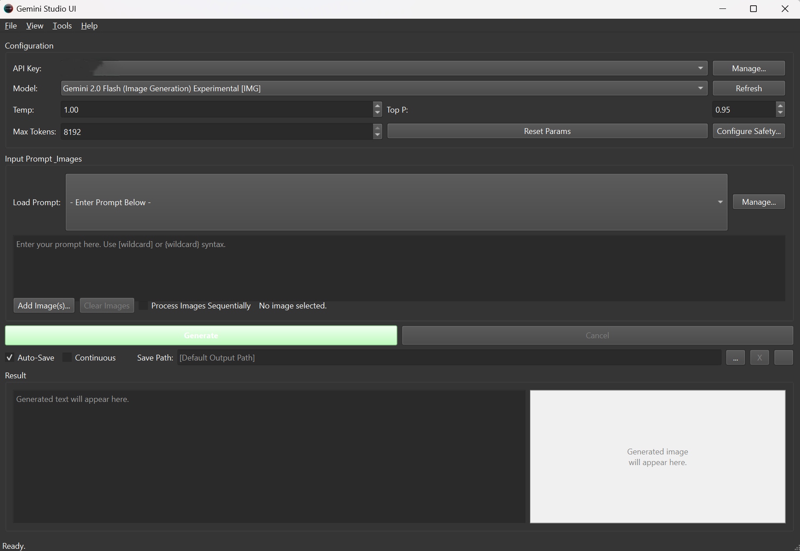

# Gemini Advanced UI

A desktop UI for interacting with the Google Gemini API, featuring multi-API key management, prompt management, and advanced wildcard support.

  

## About The Project

This project provides a user-friendly graphical interface for Google's Gemini models. It was built to streamline workflows for users who frequently generate content and need to manage multiple prompts and API keys efficiently.

## Features

-   **Single & Multi-API Modes:** Run a single generation or multiple parallel instances.
-   **API Key Manager:** Securely store and manage multiple Google AI Studio API keys.
-   **Prompt Manager:** Save, edit, and quickly load your favorite prompts.
-   **Advanced Wildcard System:** Use `[wildcard]` and `{wildcard}` syntax, including consistency `[1:wildcard]`, repetition `[wildcard:3]`, and choice `[male|female]` operators.
-   **Theming:** Supports Light, Dark, and custom `.qss` themes.
-   **And more...**

## Getting Started

Follow these steps to get a local copy up and running.

### Prerequisites

-   Python 3.9+
-   An API key from [Google AI Studio](https://aistudio.google.com/app/apikey)

### Installation

1.  Clone the repository:
    ```bash
    git clone https://github.com/YOUR_USERNAME/GeminiAdvancedUI.git
    ```
2.  Navigate to the project directory:
    ```bash
    cd GeminiAdvancedUI
    ```
3.  Create and activate a virtual environment:
    ```bash
    # On Windows
    python -m venv venv
    .\venv\Scripts\activate

    # On macOS/Linux
    python3 -m venv venv
    source venv/bin/activate
    ```
4.  Install the required packages:
    ```bash
    pip install -r requirements.txt
    ```

## Usage

1.  Run the application:
    ```bash
    python main_app.py
    ```
2.  The first time you run it, the application will create a `data` directory.
3.  Go to **Tools -> API Key Manager** to add your Google API key.
4.  Configure your prompt and settings, and click **Generate**!

## License

Distributed under the MIT License. See `LICENSE` for more information.
